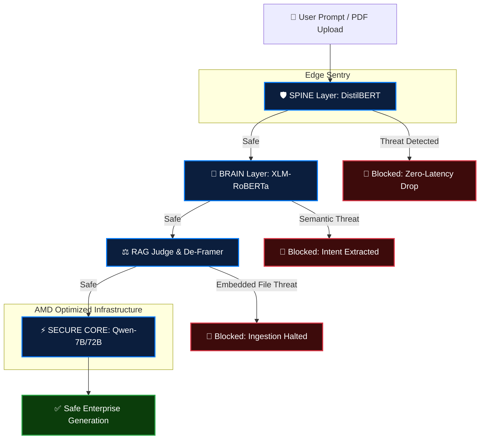

# 🛡️ IntelliGuard | Enterprise Prompt Injection Firewall

**IntelliGuard** is a zero-trust, multi-layered AI security firewall designed to protect enterprise LLMs and autonomous agents from deep semantic jailbreaks, zero-click exploits, and multimodal prompt injections. 

This Hugging Face Space serves as the lightweight frontend. All heavy inference is routed remotely to an **AMD Instinct MI300X** cloud instance, demonstrating production-grade, split-stack deployment.

## 🚀 How to Use This Space
1. **Live Scanner:** Navigate to the first tab to manually type payloads or use the Quick Insert test vectors (e.g., Base64 Smuggling, Roleplay Jailbreaks).
2. **Batch Demo:** Run a high-speed test of 20 concurrent payloads to evaluate the throughput of the connected AMD hardware.
3. **API Integration:** This frontend defaults to a simulated local instance if the main cloud server spins down, but can be configured to point to any active backend via the `INTELLIGUARD_API` environment variable.

## 🧠 The 4-Layer Architecture

Instead of relying on a single, easily bypassed classifier, IntelliGuard forces all input through a specialized funnel:

```text
[User Prompt / Inbound Email] 
       │
       ▼
 1. SPINE (DistilBERT) ——> Catches structural syntax & hacker code (90.4% F1)
       │
       ▼
 2. DECODER —————————————> Unpacks Base64, Hex, and hidden text smuggling
       │
       ▼
 3. BRAIN (XLM-RoBERTa) —> Catches semantic roleplay & native languages (99.1% F1)
       │
       ▼
 4. JUDGE (Ensemble NN) —> Final consensus evaluation 
       │
       ▼
[EXECUTOR / AGENT] ——> Payload verified safe. Allowed to process.
```

## Architecture Pipeline


## 📄 Technical Documentation
Detailed mathematical specifications and architectural deep-dives can be found in the:
[Technical Specification: IntelliGuard Detection Mathematics](./Technical%20Specification_%20IntelliGuard%20Detection%20Mathematics.pdf)

## 📊 Benchmark Details
Comprehensive performance metrics, hardware speedups (AMD Instinct MI300X vs. CPU), and accuracy breakdowns are available in:
[BENCHMARK.md](./BENCHMARK.md)

## 🛠️ Project Structure
- `app.py`: Gradio frontend (Hugging Face Space)
- `rag_portal.py`: Streamlit enterprise RAG portal
- `scripts/main.py`: FastAPI backend (Inference server)
- `notebooks/`: Research and model training notebooks
- `models/`: Local model checkpoints (Judge NN)
- `datasets/`: Training and validation data samples
